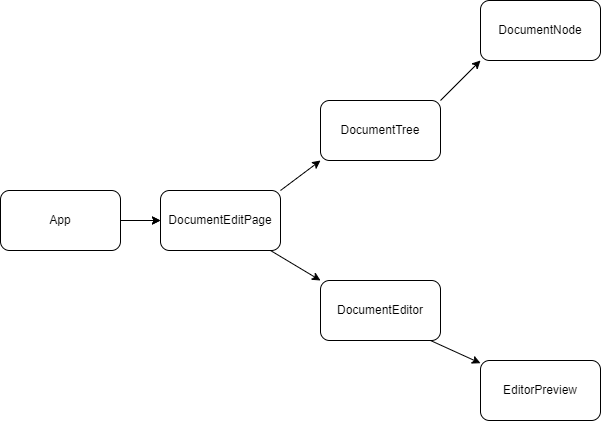

# 📝YENOTION

## 🔸 프로젝트 소개 및 수행 기간

* API를 활용하여 문서 자동 저장 편집기를 구현합니다. 필수 기능을 구현 후 추가 기능을 자유롭게 구현합니다.

> - 프로젝트 수행 기간 : 2022년 11월 8일(화) ~ 2022년 11월 16일(수)
> - 멘티 코드 리뷰 기간 : 2022년 11월 17일(목) ~ 2022년 11월 20일(일)
> - 멘토 코드 리뷰 기간 : 2022년 11월 17일(목) ~ 2022년 11월 22일(화)
> - 코드 리뷰 반영 기간 : 2022년 11월 23일(수) ~ 2022년 11월 25일(금)

## 🔸 구조 설계

### 와이어프레임

###  컴포넌트 구조

## 🔸 기능 명세

### 기본 기능

- [x] 메인 페이지 왼쪽에 전체 문서 트리를 출력합니다.
  - 루트 문서를 클릭하면 오른쪽 편집기 영역에 문서 내용을 렌더링합니다.
  - 문서 이름이 특정 길이를 넘으면 특정 길이까지 자르고 ... 생략으로 표시한다.

- [x] 새로운 문서를 생성할 수 있습니다.
  - 각 문서의 우측에 + 버튼이 있고, 해당 버튼을 클릭하면 하위에 새로운 문서 생성되고 편집 화면으로 넘어갑니다.
  - 루트 문서 또는 특정 문서 하위에 새로운 문서를 추가할 수 있습니다.
  
- [x] 문서를 수정하고 저장할 수 있습니다.
  - 문서 저장 버튼을 따로 만들지 않습니다.
  - document save api를 이용, 서버에 지속적인 요청을 통해 저장되도록 설정합니다.
- 문서의 내용은 마크다운 문법을 사용하여 나타낼 수 있습니다.
    
  - 오른편 문서 미리보기에서 실제 페이지의 내용을 확인할 수 있습니다.
  
- [x] 문서를 삭제할 수 있습니다.

- [x] History API를 활용하여 SPA로 제작합니다.
  - 루트 URL: 문서 선택이 아직 안 된 상태를 보여줍니다.
    * 편집기에는 기본 페이지 출력
  - /documents/{documentId}: 해당 문서의 내용을 불러와 편집기에 출력

  

### 추가 기능

[과제 제안]

- [x] 기본적으로 편집기는 textarea 기반으로 단순한 텍스트 편집기로 시작하되, 여력이 되면 div와 contentEditable을 조합해서 좀 더 Rich한 에디터를 만들어봅니다.

- [x] 편집기 최하단에는 현재 편집 중인 문서의 하위 문서들의 링크를 추가.

- [ ] `페이지 멘션`: 편집기 내에서 @시작해서 다른 문서의 title을 적은 경우, 자동으로 해당 Document의 편집 페이지로 이동하는 링크를 거는 기능을 추가합니다.

[기타 아이디어 정리]

* 마크다운 편집기 만들기
* 검색 기능
* 다크모드
* 임베드
* 북마크
* 하이라이팅
* 이미지 임베딩
* 공유하기
* undo, redo
* 수정이력 출력
* 과거 상태로 돌아가기

## 🔸느낀점	

* 계획을 거창하게 세우고 시작했지만, 결론적으로 추가 기능을 많이 구현하지 못했다. 일주일 온전히 프로젝트를 수행했으면 진도를 더 많이 나갈 수 있었겠지만,, 그래도 다음 개발 일정 산정은 더 잘해보자!
* SPA로 개발 시 페이지 새로고침 시 문제가 발생하는 점 -> express 같은 서버를 따로 두는 것이 필요할 것 같다.
* 이번 프로젝트에서 API 주소를 가리기 위해 API 주소를 담은 파일을 gitignore로 설정하여 git에 올라가지 않도록 처리했지만 -> 이런 경우 어떻게 배포를 할 수 있을지와 같은 고민과, 환경 변수로 정의해서 사용했으면 더 좋았을 거 같다는 생각이 들었다.
* API 비동기 통신 로직을 따로 utils 함수로 분리해주었는데, 함수를 계속 분리하다 보니 API 요청하고 응답 받아온 후 데이터를 사용하는 부분에서 살짝 버벅였다.. async await 구문을 사용할 때 반환값이 promise이기 때문에 바로 하위 컴포넌트로 넘기지 않고 ->  setState로 부모에 저장하고 이후 하위 컴포넌트에 값을 전달했다. -> 처음에 비동기 통신하는 일련의 과정(비동기 요청, 응답 후 상태값 변경 후 리렌더링)이 잘 안돼서 꼼꼼히 확인하면서 작업했다.
* 바닐라 자바스크립트로 작업하는 건 재밌게 느껴지는데, css에서 class명 관리 및 스타일 속성 재사용, 상태값 관리, 리렌더링 등 신경써야 하는 것들이 많아서 라이브러리, 프레임워크 사용이 훨씬 편하긴 하다.

